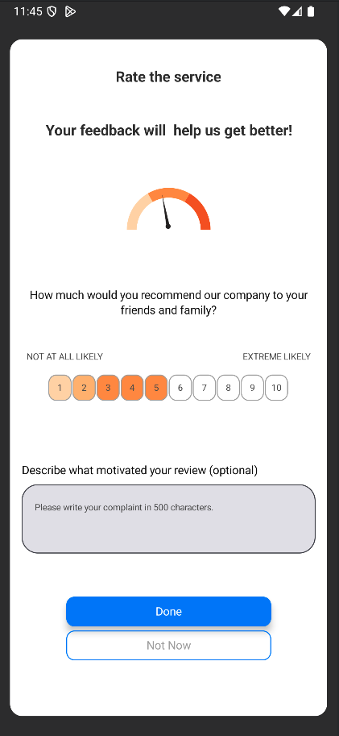
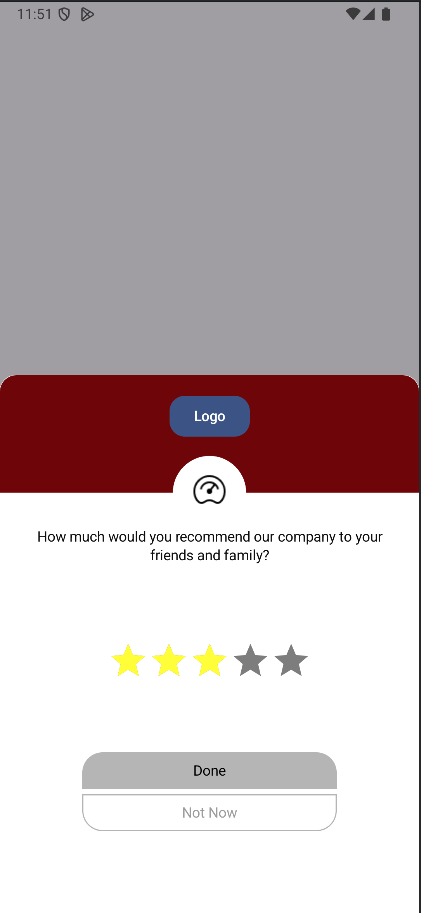

# NetPromoterScoreKit-Android

A comprehensive Android SDK built with Jetpack Compose for collecting Net Promoter Score (NPS) feedback. Features a polished, customizable UI, robust networking with retry mechanisms, and a simple integration API.

## Features

- 🎨 **Two Beautiful UI Styles**: Popover1 and Popover2 with extensive customization options
- 🔧 **Highly Configurable**: Customize colors, text, shapes, and even inject custom Composables
- 🌐 **Built-in Networking**: Automatic API calls with retry logic and error handling
- 📱 **Jetpack Compose**: Modern, declarative UI framework
- 🔄 **State Management**: Reactive state handling with ViewModel and StateFlow
- 🛡️ **Error Handling**: Comprehensive error handling with custom error entities
- ⚡ **Lightweight**: Minimal dependencies, optimized for performance

## Installation

### Step 1: Add JitPack Repository

Add JitPack to your project's `settings.gradle.kts`:

```kotlin
pluginManagement {
    repositories {
        google()
        mavenCentral()
        gradlePluginPortal()
    }
}

dependencyResolutionManagement {
    repositoriesMode.set(RepositoriesMode.FAIL_ON_PROJECT_REPOS)
    repositories {
        google()
        mavenCentral()
        maven { url = uri("https://jitpack.io") }
    }
}
```

### Step 2: Add Dependency

Add the library to your app's `build.gradle.kts`:

```kotlin
dependencies {
    implementation("com.github.YourUsername:NetPromoterScoreExample:0.0.1")
}
```

Replace `YourUsername` with your GitHub username and `0.0.1` with your desired version tag.

### Step 3: Configure API Endpoint

Add your API base URL to `local.properties`:

```properties
API_URL=https://your-api-domain.com/api/nps
```

The library will automatically append `/view` and `/submit` endpoints to this URL.

## Quick Start

### Basic Integration

```kotlin
import com.sepanta.controlkit.netpromoterscore.netPromoterScoreKitHost
import com.sepanta.controlkit.netpromoterscore.config.NetPromoterScoreServiceConfig
import com.sepanta.controlkit.netpromoterscore.view.config.NetPromoterScoreViewConfig
import com.sepanta.controlkit.netpromoterscore.view.config.NetPromoterScoreViewStyle

@Composable
fun MyApp() {
    val npsConfig = NetPromoterScoreServiceConfig(
        appId = "your-unique-app-id",
        name = "main-app-feedback",
        version = "1.0.0",
        viewConfig = NetPromoterScoreViewConfig(
            viewStyle = NetPromoterScoreViewStyle.Popover1
        )
    )
    
    val npsKit = netPromoterScoreKitHost(
        config = npsConfig,
        onDismiss = { 
            // Called when user dismisses the dialog
            Log.d("NPS", "Dialog dismissed")
        },
        onState = { state ->
            // Handle different states
            when (state) {
                is ViewModelState.Success -> {
                    // Show success message
                    Toast.makeText(context, "Thank you for your feedback!", Toast.LENGTH_SHORT).show()
                }
                is ViewModelState.Error -> {
                    // Handle error
                    Log.e("NPS", "Error: ${state.data}")
                }
                ViewModelState.NoContent -> {
                    // No content returned from server
                }
                else -> { /* Other states */ }
            }
        }
    )
    
    // Show NPS dialog when needed
    Button(onClick = { npsKit.showView() }) {
        Text("Rate Our App")
    }
}
```

## Configuration Guide

### Service Configuration

The `NetPromoterScoreServiceConfig` class controls the core behavior:

```kotlin
data class NetPromoterScoreServiceConfig(
    // UI Configuration
    var viewConfig: NetPromoterScoreViewConfig = NetPromoterScoreViewConfig(),
    
    // App Information
    var version: String = "0.0.0",        // Your app version
    var appId: String,                    // Unique app identifier (sent as x-app-id header)
    var name: String,                     // Survey/campaign name
    
    // Device Identification
    var deviceId: String? = null,         // Optional. Auto-generated UUID if null
    
    // Network Configuration
    var timeOut: Long = 5000L,            // HTTP timeout in milliseconds
    var timeRetryThreadSleep: Long = 1000L, // Retry delay in milliseconds
    var maxRetry: Int = 5,                // Maximum retry attempts
)
```

### View Configuration

The `NetPromoterScoreViewConfig` class provides extensive UI customization:

```kotlin
val viewConfig = NetPromoterScoreViewConfig(
    // Style Selection
    viewStyle = NetPromoterScoreViewStyle.Popover2,
    
    // Scoring Configuration
    totalScore = 10,                      // Maximum score (default: 5)
    
    // Text Content
    headerTitle = "How was your experience?",
    descriptionTitle = "Your feedback helps us improve!",
    questionTitle = "How likely are you to recommend us to a friend?",
    lowScoreTitle = "Not at all likely",
    highScoreTitle = "Extremely likely",
    
    // Button Labels
    submitButtonTitle = "Submit Feedback",
    cancelButtonTitle = "Maybe Later",
    
    // Colors
    popupViewBackGroundColor = Color.White,
    submitButtonColor = ButtonDefaults.buttonColors(containerColor = Color(0xFF2196F3)),
    cancelButtonColor = ButtonDefaults.buttonColors(containerColor = Color.Gray),
    
    // Typography
    headerTitleTextStyle = TextStyle(
        fontSize = 18.sp,
        fontWeight = FontWeight.Bold,
        color = Color.Black
    ),
    
    // Shapes
    popupViewCornerRadius = RoundedCornerShape(16.dp),
    submitButtonCornerRadius = RoundedCornerShape(8.dp),
    
    // Custom Modifiers
    popupViewLayoutModifier = Modifier.padding(16.dp),
    submitButtonLayoutModifier = Modifier.fillMaxWidth()
)
```

## UI Styles

The library provides two distinct UI styles:

### Popover1 Style


**Characteristics:**
- Compact design
- Star-based rating system
- Minimal text
- Perfect for quick feedback

### Popover2 Style


**Characteristics:**
- Detailed layout
- Number-based scoring
- Rich text descriptions
- Ideal for comprehensive feedback

## Advanced Usage Examples

### 1. Conditional Display Based on User Actions

```kotlin
@Composable
fun ProductDetailScreen() {
    var showNPS by remember { mutableStateOf(false) }
    
    val npsKit = netPromoterScoreKitHost(config)
    
    LaunchedEffect(showNPS) {
        if (showNPS) {
            npsKit.showView()
            showNPS = false
        }
    }
    
    Column {
        // Your product content
        ProductContent()
        
        Button(
            onClick = { 
                // Show NPS after user completes a purchase
                showNPS = true 
            }
        ) {
            Text("Complete Purchase")
        }
    }
}
```

### 2. Multiple Survey Campaigns

```kotlin
@Composable
fun AppWithMultipleSurveys() {
    val mainSurveyConfig = NetPromoterScoreServiceConfig(
        appId = "app-main",
        name = "general-satisfaction",
        version = "1.0.0",
        viewConfig = NetPromoterScoreViewConfig(
            viewStyle = NetPromoterScoreViewStyle.Popover1,
            headerTitle = "How do you like our app?"
        )
    )
    
    val featureSurveyConfig = NetPromoterScoreServiceConfig(
        appId = "app-main",
        name = "new-feature-feedback",
        version = "1.0.0",
        viewConfig = NetPromoterScoreViewConfig(
            viewStyle = NetPromoterScoreViewStyle.Popover2,
            headerTitle = "How was the new feature?"
        )
    )
    
    val mainKit = netPromoterScoreKitHost(mainSurveyConfig)
    val featureKit = netPromoterScoreKitHost(featureSurveyConfig)
    
    // Use different kits for different contexts
}
```

### 3. Custom Styling with Brand Colors

```kotlin
val brandConfig = NetPromoterScoreViewConfig(
    viewStyle = NetPromoterScoreViewStyle.Popover2,
    
    // Brand colors
    popupViewBackGroundColor = Color(0xFFF5F5F5),
    submitButtonColor = ButtonDefaults.buttonColors(
        containerColor = Color(0xFF1976D2)
    ),
    cancelButtonColor = ButtonDefaults.buttonColors(
        containerColor = Color(0xFF757575)
    ),
    
    // Custom typography
    headerTitleTextStyle = TextStyle(
        fontSize = 20.sp,
        fontWeight = FontWeight.Bold,
        color = Color(0xFF1976D2)
    ),
    
    // Custom shapes
    popupViewCornerRadius = RoundedCornerShape(20.dp),
    submitButtonCornerRadius = RoundedCornerShape(25.dp),
    
    // Custom spacing
    popupViewLayoutModifier = Modifier
        .padding(24.dp)
        .shadow(8.dp, RoundedCornerShape(20.dp))
)
```

### 4. State Management and Error Handling

```kotlin
@Composable
fun NPSWithStateManagement() {
    var showSuccessSnackbar by remember { mutableStateOf(false) }
    var showErrorSnackbar by remember { mutableStateOf(false) }
    var errorMessage by remember { mutableStateOf("") }
    
    val npsKit = netPromoterScoreKitHost(
        config = config,
        onState = { state ->
            when (state) {
                is ViewModelState.Success -> {
                    showSuccessSnackbar = true
                }
                is ViewModelState.Error -> {
                    errorMessage = when (state.data) {
                        is ApiError<*> -> "Network error occurred"
                        else -> "Unknown error"
                    }
                    showErrorSnackbar = true
                }
                ViewModelState.NoContent -> {
                    // Handle no content case
                }
                else -> { /* Other states */ }
            }
        }
    )
    
    // Your UI content
    Column {
        Button(onClick = { npsKit.showView() }) {
            Text("Show Feedback Dialog")
        }
    }
    
    // Snackbars for feedback
    if (showSuccessSnackbar) {
        LaunchedEffect(Unit) {
            delay(2000)
            showSuccessSnackbar = false
        }
        // Show success snackbar
    }
    
    if (showErrorSnackbar) {
        LaunchedEffect(Unit) {
            delay(3000)
            showErrorSnackbar = false
        }
        // Show error snackbar
    }
}
```

### 5. Integration with Navigation

```kotlin
@Composable
fun AppNavigation() {
    val navController = rememberNavController()
    
    NavHost(navController = navController, startDestination = "home") {
        composable("home") {
            HomeScreen(
                onNavigateToFeedback = {
                    navController.navigate("feedback")
                }
            )
        }
        
        composable("feedback") {
            FeedbackScreen()
        }
    }
}

@Composable
fun FeedbackScreen() {
    val npsKit = netPromoterScoreKitHost(
        config = config,
        onDismiss = {
            // Navigate back when dialog is dismissed
            navController.popBackStack()
        }
    )
    
    LaunchedEffect(Unit) {
        npsKit.showView()
    }
}
```

## API Integration

### Request Headers

The library automatically sends these headers with every request:

```
x-app-id: Your app ID
x-version: Your app version
x-device-uuid: Device identifier (auto-generated or custom)
x-sdk-version: Library version
Accept: application/json
Authorization: Bearer 123
platform: android
```

### API Endpoints

#### View Action (POST)
**URL:** `${API_URL}/view`
**Purpose:** Track when the NPS dialog is shown
**Body:**
```
name: Survey/campaign name
```

#### Submit Action (POST)
**URL:** `${API_URL}/submit`
**Purpose:** Submit user's NPS score and feedback
**Body:**
```
name: Survey/campaign name
score: User's rating (1 to totalScore)
comment: User's optional text feedback
```

### Response Handling

The library handles responses automatically:

```kotlin
// Success response
ViewModelState.Success

// Error response
ViewModelState.Error(errorData)

// No content response
ViewModelState.NoContent
```

## Customization Options

### Complete View Configuration Reference

```kotlin
NetPromoterScoreViewConfig(
    // Style and Layout
    viewStyle = NetPromoterScoreViewStyle.Popover1,
    totalScore = 5,
    
    // Images and Icons
    closeImageDrawble = R.drawable.ic_close,
    updateImageDrawble = R.drawable.ic_update,
    notchIcon = R.drawable.ic_logo,
    
    // Colors
    popupViewBackGroundColor = Color.White,
    submitButtonColor = ButtonDefaults.buttonColors(),
    cancelButtonColor = ButtonDefaults.buttonColors(),
    updateImageColor = Color.Blue,
    closeImageColor = Color.Gray,
    
    // Text Content
    headerTitle = "Rate the service",
    descriptionTitle = "Your feedback will help us get better!",
    questionTitle = "How much would you recommend our company?",
    lowScoreTitle = "NOT AT ALL LIKELY",
    highScoreTitle = "EXTREME LIKELY",
    submitButtonTitle = "Submit",
    cancelButtonTitle = "Cancel",
    
    // Typography
    headerTitleTextStyle = TextStyle(),
    descriptionTextFieldTextStyle = TextStyle(),
    
    // Shapes and Corners
    popupViewCornerRadius = RoundedCornerShape(16.dp),
    submitButtonCornerRadius = RoundedCornerShape(8.dp),
    cancelButtonCornerRadius = RoundedCornerShape(8.dp),
    
    // Custom Composables (Advanced)
    headerTitleView = { title -> 
        Text(
            text = title,
            style = MaterialTheme.typography.headlineSmall
        )
    },
    submitButtonView = { onClick ->
        Button(
            onClick = onClick,
            colors = ButtonDefaults.buttonColors(
                containerColor = Color(0xFF1976D2)
            )
        ) {
            Text("Custom Submit")
        }
    }
)
```

## Error Handling

### Common Error Scenarios

1. **Network Errors**
   - Connection timeout
   - Server unavailable
   - Invalid response format

2. **Validation Errors**
   - Missing required fields
   - Invalid score range
   - Server-side validation failures

### Error Handling Best Practices

```kotlin
val npsKit = netPromoterScoreKitHost(
    config = config,
    onState = { state ->
        when (state) {
            is ViewModelState.Error -> {
                val error = state.data
                when (error) {
                    is ApiError<*> -> {
                        // Handle API errors
                        Log.e("NPS", "API Error: ${error.errorEntity}")
                    }
                    is SocketTimeoutException -> {
                        // Handle timeout
                        showMessage("Request timed out. Please try again.")
                    }
                    is UnknownHostException -> {
                        // Handle network issues
                        showMessage("No internet connection.")
                    }
                    else -> {
                        // Handle other errors
                        showMessage("An unexpected error occurred.")
                    }
                }
            }
            else -> { /* Handle other states */ }
        }
    }
)
```

## Performance Considerations

### Memory Management
- The library uses `remember` to cache the NPS kit instance
- ViewModel is automatically managed by the Compose lifecycle
- Network requests are properly scoped to prevent memory leaks

### Network Optimization
- Built-in retry mechanism with exponential backoff
- Configurable timeouts to prevent hanging requests
- Efficient JSON serialization with Gson

### UI Performance
- Compose-based UI for smooth animations
- Lazy loading of dialog content
- Optimized state management with StateFlow

## Troubleshooting

### Common Issues

1. **Dialog not showing**
   - Ensure `kit.showView()` is called
   - Check if the NPS kit is properly initialized
   - Verify Compose context is available

2. **Network requests failing**
   - Verify `API_URL` is set in `local.properties`
   - Check network permissions in AndroidManifest.xml
   - Ensure server endpoints are accessible

3. **Custom styling not applied**
   - Verify configuration is passed correctly
   - Check if custom Composables are properly implemented
   - Ensure colors and styles are valid

### Debug Mode

Enable network logging by checking the Retrofit client configuration:

```kotlin
// The library automatically logs HTTP requests in debug builds
// Check Logcat for "OkHttp" tags to see request/response details
```

## Requirements

- **Android SDK:** Minimum API level 24 (Android 7.0)
- **Kotlin:** 1.8.0 or higher
- **Jetpack Compose:** 1.4.0 or higher
- **Gradle:** 7.0 or higher

## Dependencies

The library includes these dependencies automatically:
- Jetpack Compose UI
- ViewModel and StateFlow
- Retrofit for networking
- OkHttp for HTTP client
- Gson for JSON serialization
- Material Design 3

## License

This project is licensed under the terms specified in the LICENSE file in the repository.

## Contributing

We welcome contributions! Please feel free to submit issues and pull requests.

## Support

For support and questions:
- Create an issue on GitHub
- Check the troubleshooting section
- Review the example app for implementation details
